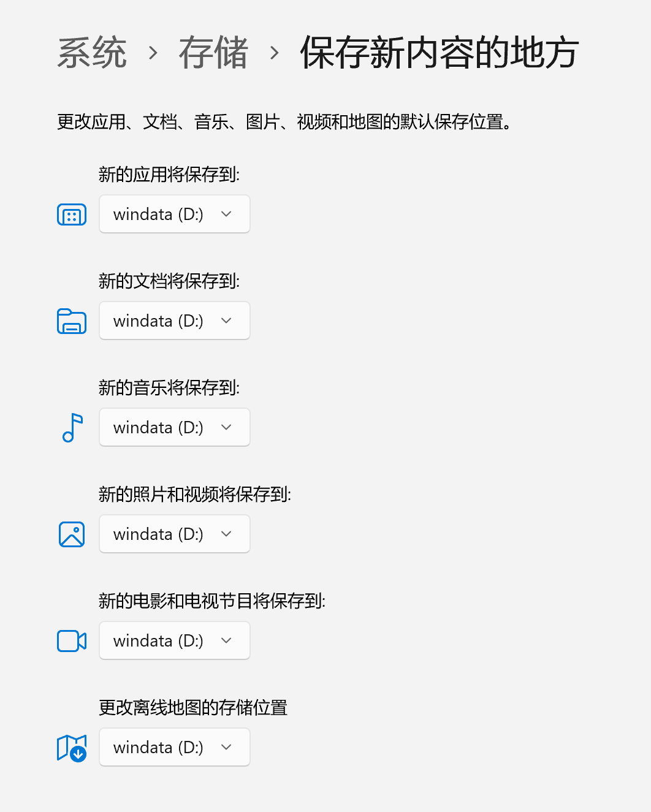
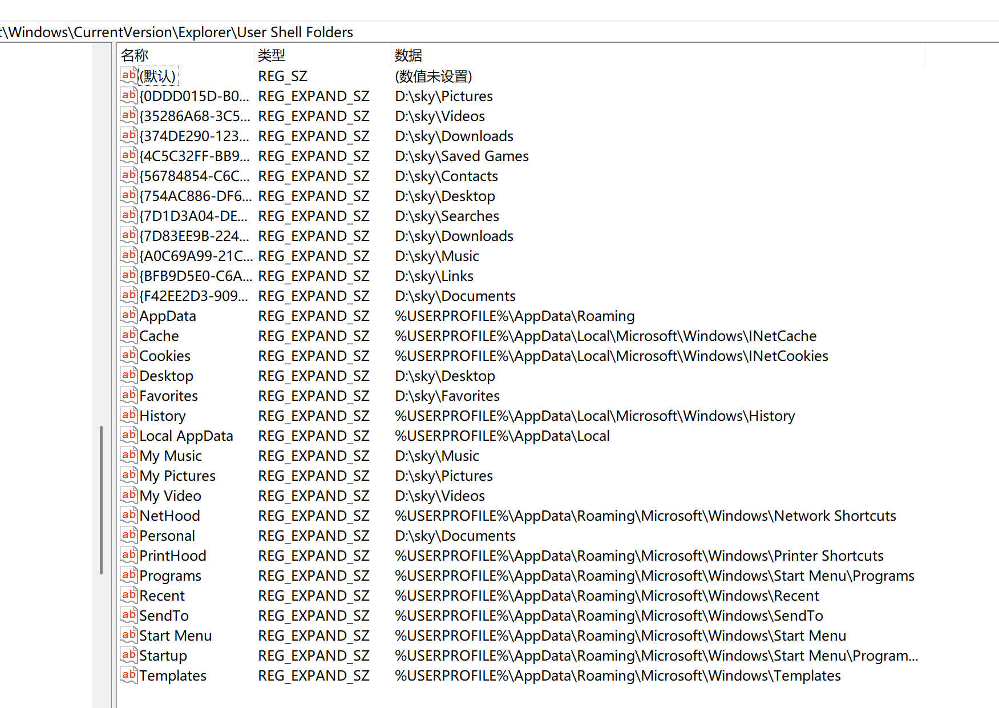
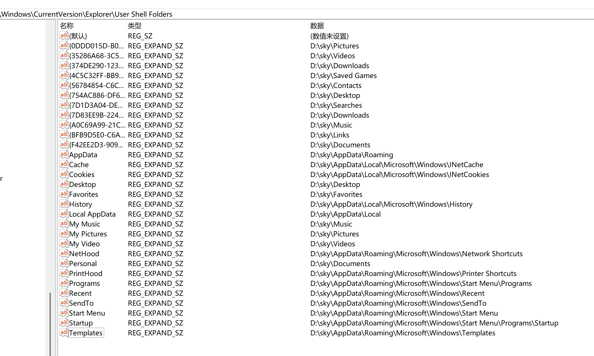

安装完成后快速进行几个操作，方便使用。

### 设置机器名

开始菜单，设置 -> 系统，"重命名" ，选择可读性的名字如 "skywork"，这个要重启之后才能生效。

### 设置文件资源管理器

打开文件资源管理器，设置固定到任务栏。

然后打开文件资源管理器的选项，设置为：

- 打开文件资源管理器时打开：此电脑
- 隐私：显示最近使用的文件，显示常用文件夹，显示来自office.com的文件全部取消勾选
- 查看中，显示隐藏的文件、文件夹和驱动器，取消隐藏已知文件夹的扩展名，在标题栏中显示完整路径

### 设置桌面主题

桌面右键，个性化 -> 主题，选择自带的第二个蓝色深色主题。

### 更改用户文件夹的默认位置

默认用户的 home 路径是在 `c:/users/` 下，会导致用户文件占据大量系统空间，不方便备份。

因此考虑将用户目录下的文件尽量放到 d 盘去。

> 备注： 这个操作尽量在安装任何程序之前进行。

开始菜单，设置 -> 系统 -> 存储 -> 高级存储设置，"保存新内容的地方" ，全部修改为 d 盘。

完成后，在 "d:/sky" 下可以看到修改后的文件夹。

然后在 "d:/sky" 这个文件夹下新建以下文件夹：

- Pictures
- Videos
- Downloads
- Desktop
- Music
- Documents

在文件资源管理器中打开主文件夹，将桌面、下载、文档、图片、音乐、视频这六个文件夹的位置修改为如上文件夹。操作的方式是右键点属性-> 位置，然后修改即可。

然后继续在  "d:/sky" 下新建如下文件夹：

- Favorites
- Searches
- Links
- Contacts
- Saved Games

在文件资源管理器中打开 "C:\Users\sky"，将收藏夹、搜索、链接、联系人、保存的游戏这五个文件夹的位置修改为如上文件夹。

按 Win+R 键打开“运行”框。现在输入 regedit 打开注册表编辑器。接下来，导航到以下路径：

HKEY_CURRENT_USER\SOFTWARE\Microsoft\Windows\CurrentVersion\Explorer\User Shell Folders

可以看到对应的修改:

此时只剩下 AppData 相关的路径没有修改，其他文件都被转移到了 d 盘。

将 "C:\Users\sky\AppData\" 目录复制到 "d:/sky" 下，中间如果报错就跳过该文件：

继续修改系统环境变量，系统 -> 高级 -> "环境变量"。

修改现有的 TEMP 和 TMP 环境变量，从默认的 "%USERPROFILE%\AppData\Local\Temp" 修改为 "D:\sky\AppData\Local\Temp"
 
修改注册表，将"%USERPROFILE%\AppData\XXX" 修改为 "D:\sky\AppData\XXX"

其实主要是 "C:\Users\sky\AppData\Roaming\Microsoft\Windows"，重启，然后删除  "C:\Users\sky\AppData\Roaming\Microsoft\Windows" 目录。

参考资料：https://cn.windows-office.net/?p=17528