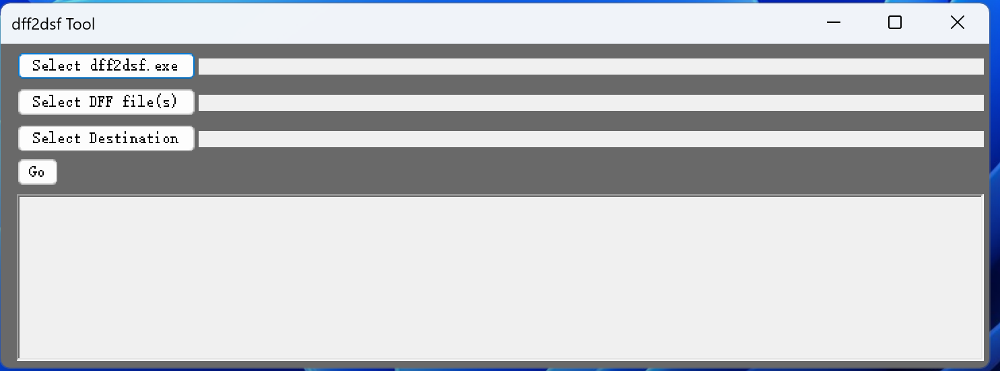
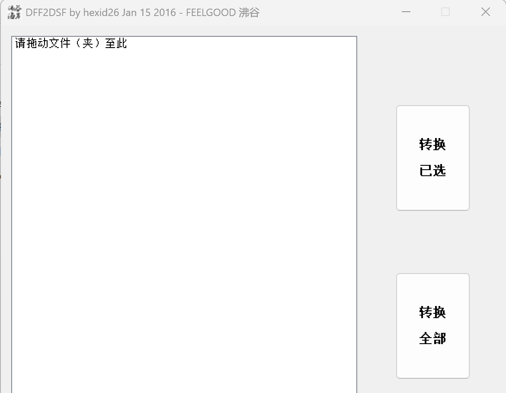

## 介绍

dff2dsf.exe 是一个将 dff 格式转为 dsf 格式的工具。

## 下载

### dff2dsf.exe

https://aur.archlinux.org/packages/dff2dsf

下载得到 dff2dsf-122.zip 文件，解压缩后在 win32 目录下得到 dff2dsf.exe 文件。

### dff2dsf tool

https://github.com/Lazar-Razvan/dff2dsfTool/releases/

下载得到 dff2dsfTool.exe 文件。

### dff2dsf shell

https://github.com/dff2dsf/dff2dsf-shell

## 使用

将上面下载得到的三个文件放在同一个文件夹中。

1. dff2dsf.exe
2. dff2dsfTool.exe
3. DFF2DSF-Shell.exe

### dff2dsftool

dff2dsftool 提供图形界面，使用非常简单。

### DFF2DSF Shell

DFF2DSF-Shell.exe 同样也提供图形界面：

1. 将想要转换的 DFF 文件或者含有 DFF 文件的文件夹拖到列表里面
2. 软件会自动筛选出 DFF 文件
3. 点击转换
4. 目录不能有汉字，空格或者特殊符号

