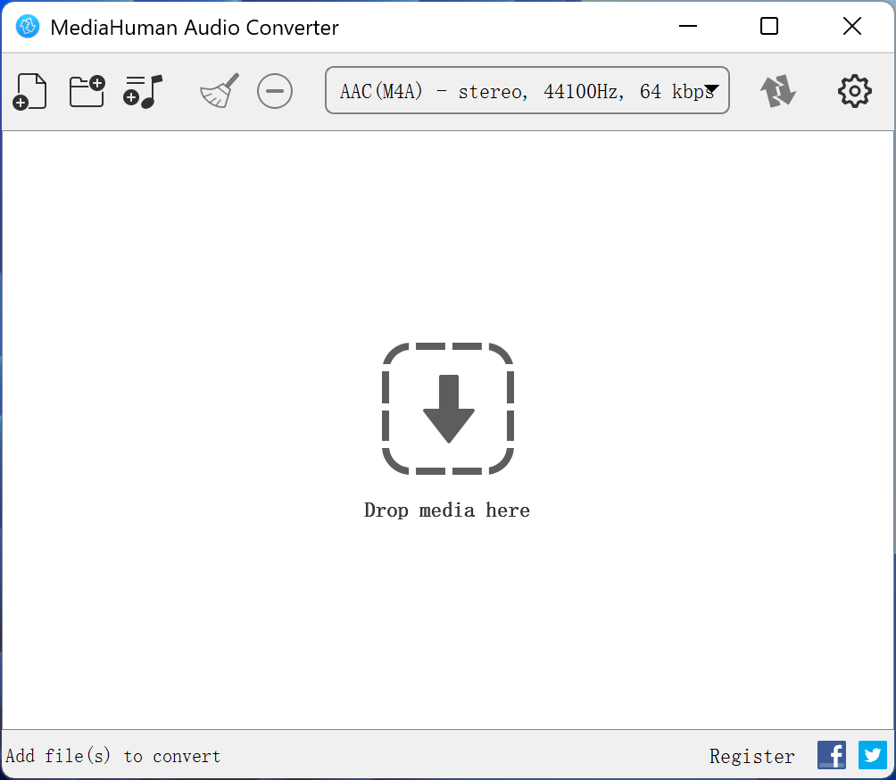

## 介绍

https://www.mediahuman.com/audio-converter/

MediaHuman Audio Converter 是一款适用于 macOS 和 Windows 的免费应用程序。有了它，你可以转换 MP3、AAC、WMA、OGG 等格式的音乐，也可以转换 FLAC、Apple Lossless、AIFF、WAV（最高 32 位）等无损格式的音乐。

> 备注：基本上我都是用这个软件来转换音乐文件格式。

## 下载

https://www.mediahuman.com/audio-converter/downloading-win.html

下载得到 MHAudioConverter.exe 文件。

## 安装

双击 MHAudioConverter.exe 文件，按照提示安装即可。

## 使用

将要转换的文件拖到软件中，然后选择转换格式，点击转换即可。

