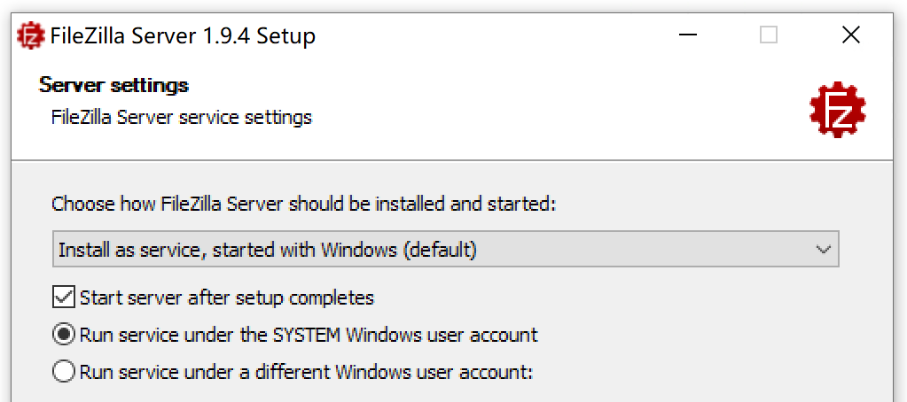
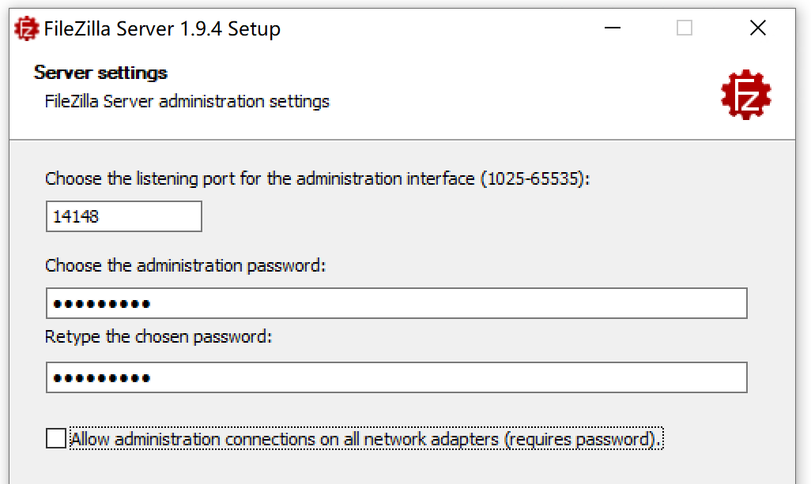
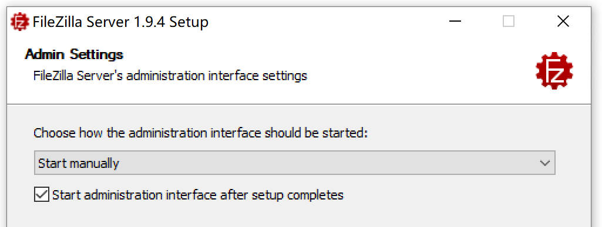
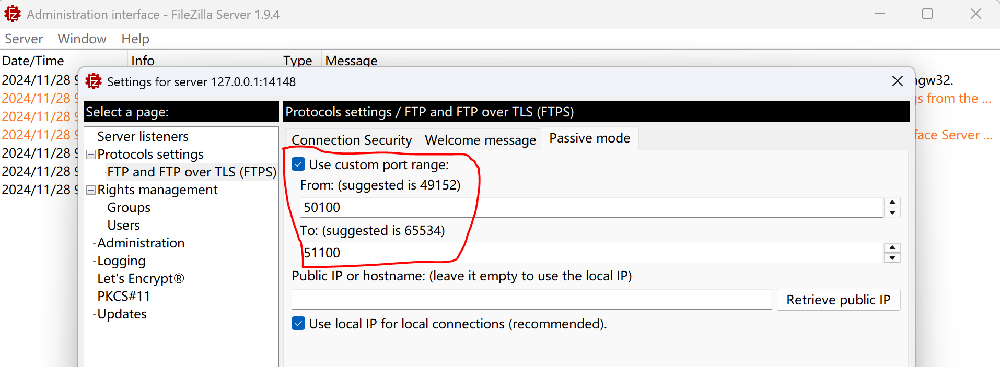
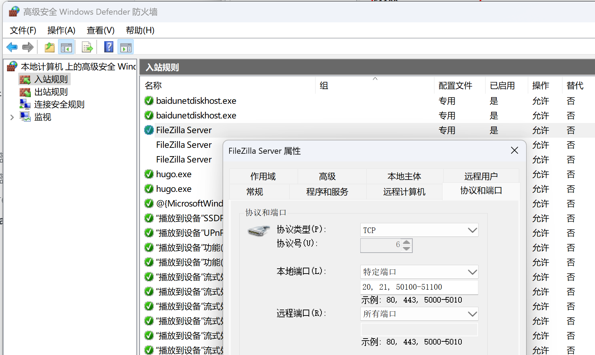

## 介绍

https://filezilla-project.org/

免费的FTP解决方案。FileZilla客户端不仅支持FTP，还支持基于TLS的FTP（FTPS）和SFTP。它是在GNU通用公共许可证条款下免费分发的开源软件。

我们还提供FileZilla Pro，支持WebDAV、Amazon S3、Backblaze B2、Dropbox、微软OneDrive、谷歌驱动器、微软Azure Blob和文件存储以及谷歌云存储等其他协议。

最后，FileZilla Server是一个免费的开源FTP和FTPS服务器。

## FileZilla Client

免费，功能也够用，不过 FileZilla Pro 有方便的破解版本可以用。就直接用 FileZilla Pro 了。

## FileZilla Pro

正常安装，用 crack 文件覆盖 FileZilla.exe 就可以破解。

配置一下文件大小显示，默认是 byte，数字太大数不过来。

打开 "编辑" -> "设置" -> "界面" -> "文件大小格式"，从默认第一个的 "以字节为单位显示"，修改为第三个 "使用SI式二进制前缀"，取消 "使用千位分隔符" 的勾选。

## FileZilla Server

### 安装

安装时注意：

- FileZilla Server 要设置为服务器，开机自动启动

  

- 需要设置管理端口（默认14148）和管理密码

  

- administration interface 要设置为手动打开，不要自动启动。毕竟 ftp 服务器一旦设置好，日常是不需要改动的。

  

### 容许外部访问 

FileZilla Server 启动后，用 FileZilla Client 在本机可以正常连接和访问。但是从其他机器连接就会失败，这通常是因为 windows 防火墙阻止了外部访问 FileZilla Server。

解决的方式是：

1. 通过 administration interface 设置 FileZilla Server passive mode 的自定义端口范围，如 50100 到 51100

  

2. 容许应用 FileZilla Server 通过防火墙进行通讯

  控制面板 -> 系统和安全 -> 容许应用或者功能通过 windows defender 防火墙 -> 容许的应用

  选择 "更改设置" -> "容许其他应用"，增加 "FileZilla Server"，指向 "C:\Program Files\FileZilla Server\filezilla-server.exe"

  

3. 设置入站规则，开启自定义的端口

  控制面板 -> 系统和安全 -> windows defender 防火墙 -> 高级设置

  在 "协议和端口" -> "本地端口" 中选择 "特定端口"，输入 "20,21,50100-51100"

  

这样就可以从其他机器访问到 FileZilla Server。

### 容许公网访问

必要时，打开路由器的端口映射，可以容许从外网访问内部 ftp 服务器。

需要映射的端口有：

- 20-21
- 50100-51100

openwrt 中的配置如下：

注意：这样把内部 ftp 服务器暴露给公网非常不安全，因此只能临时要用的时候开启一下，用完就关闭（把后面的勾选去掉即可）。