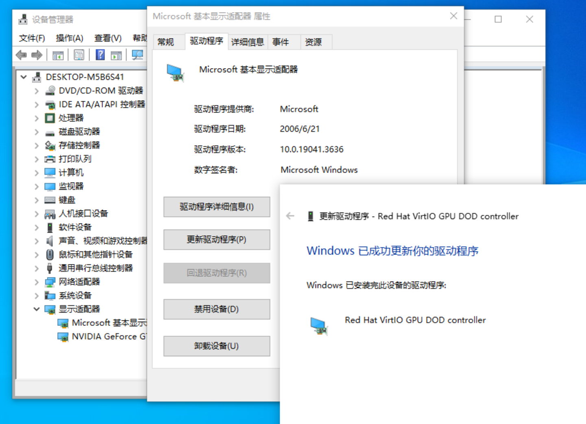

## 统一安装驱动

启动虚拟机前，挂载 virtio-win-0.1.248.iso 驱动光盘。

进去 windows 虚拟机后，打开 cd 驱动器，在根目录下找到 virtio-win-gt.x64 文件，双击打开开始安装驱动。

### 安装显卡驱动

修改虚拟机硬件配置，将 display（显卡）修改为 VirtIO-GPU，显存修改为 256M。

启动虚拟机前，挂载 virtio-win-0.1.248.iso 驱动光盘。

启动虚拟机后，打开设备管理器，找到显示适配器中的 "microsoft 基本显示适配器"，右键点击更新驱动程序，选择浏览计算机以查找驱动程序软件，点击浏览，选择光盘路径，勾选包含子目录。这样就能自动找到显卡的驱动，完成安装。

## 安装 virtio-win guest tools

在 cd 驱动器根目录下找到 virtio-win-guest-tools.exe 文件，双击打开开始安装。
