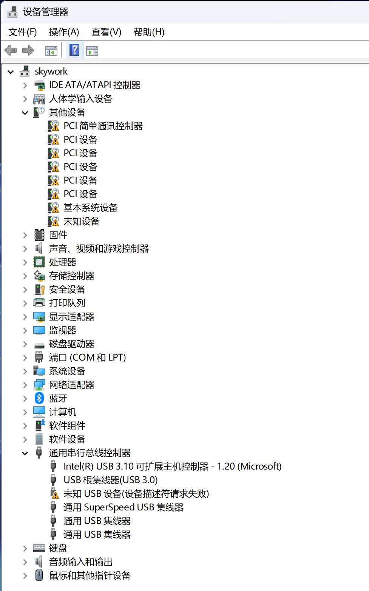
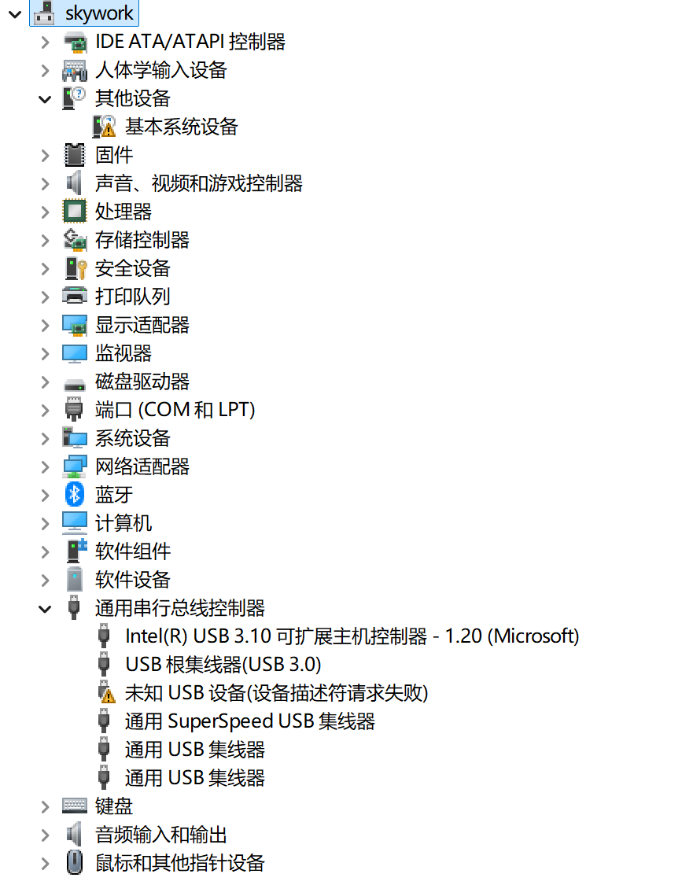

备注： 以前有不少自动识别和安装驱动的软件，挺好用，但一个一个都转型为流氓软件了，因此现在只手工安装驱动。麻烦但是安全。

## 主板驱动

### intel 主板

比较恶心的是在 intel 的下载中心，我找不到 intel 主板驱动：

https://www.intel.com/content/www/us/en/download-center/home.html

chipset 里面只找到 chipset-inf-utility 这个东东，但一点用处都没有。

https://www.intel.com/content/www/us/en/download/19347/chipset-inf-utility.html

最后还是在华硕主板的驱动下载页面找到了 intel 主板的相关驱动下载。

比如在 [TUF GAMING B760-PLUS WIFI D4](https://www.asus.com/motherboards-components/motherboards/tuf-gaming/tuf-gaming-b760-plus-wifi-d4/helpdesk_download?model2Name=TUF-GAMING-B760-PLUS-WIFI-D4) 主板的驱动下载页面。

- Intel Chipset driver

  这是最重要的主板驱动了。

- intel Serial IO Driver

  这个 Serial IO Driver 驱动其实没有什么用处，就是可以让设备管理器里面没有那么多黄色惊叹号。这是安装前：

  

  安装之后：

  

- Intel GNA Driver

  上面图片中，在其他设备中有一个黄色惊叹号，"基本系统装置"，错误信息为：

  设备 PCI\VEN_8086&DEV_A74F&SUBSYS_00000000&REV_00\3&11583659&0&40 需要进一步安装。

  这个需要安装 intel GNA driver，安装完成后就不报错了。

- Intel Management Engine Interface
- Intel Dynamic Tuning Technology (APO) Driver
- Intel DTT 9.0.11405.42569 (Ipf driver V1.0.11405.42038)
  
  这三个不知道是什么，顺手安装。

## 显卡驱动

### nvidia显卡

windows 11 自带 nvidia 显卡驱动，而且版本还算新，不过缺少 HD 音频驱动程序，physX系统软件和Gefore Experience软件。所以还是下载官方驱动安装吧。

https://www.nvidia.cn/drivers/lookup/

按照型号找到对应版本的驱动下载即可。

nvidia 登录时如果报错 403 forbidden，注意不要用科学上网，直接用普通网络访问即可。

### intel 核显

https://www.intel.com/content/www/us/en/download/741626/intel-arc-pro-graphics-windows.html

Intel® Graphics Driver 32.0.101.5978 for Intel® Arc™ Pro Series Graphics

支持 intel 11/12/13/14代处理器的核显，以及 Arc 显卡家族。

其他类似驱动：

- [Intel® 7th-10th Gen Processor Graphics](https://www.intel.com/content/www/us/en/download/776137/intel-7th-10th-gen-processor-graphics-windows.html)

## 网卡和蓝牙驱动

### Intel

intel 的网卡和蓝牙驱动可以由工具软件 Intel® Driver & Support Assistant (Intel® DSA) 来安装驱动

https://www.intel.com/content/www/us/en/support/detect.html

这个软件会自动启动，然后由于 intel 驱动经常更新，会经常提示要更新驱动。但这些新驱动基本没有什么用，很浪费时间。

建议安装完成之后，就卸载 Intel® Driver & Support Assistant。

### realteck 千兆和2.5g网卡驱动

windows11自带驱动，貌似也能用，就不手工安装了。

## 声卡

### realteck 声卡

windows11自带驱动，貌似也能用，就不手工安装了。

备注：q1hy板载的 realtek alc897 声卡莫名其妙的无法安装驱动。各个版本都不行。算了，放弃。

https://oemdrivers.com/sound-realtek-alc897-x64 