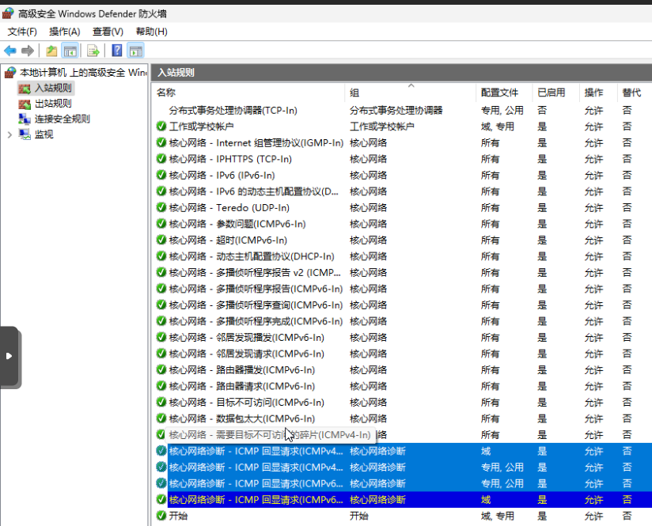
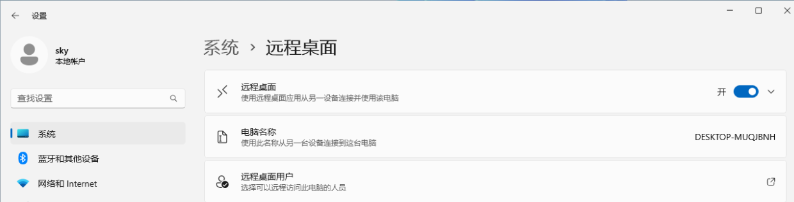
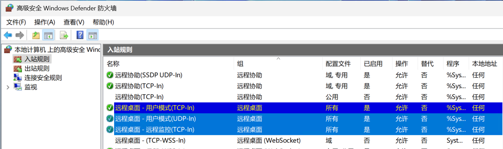
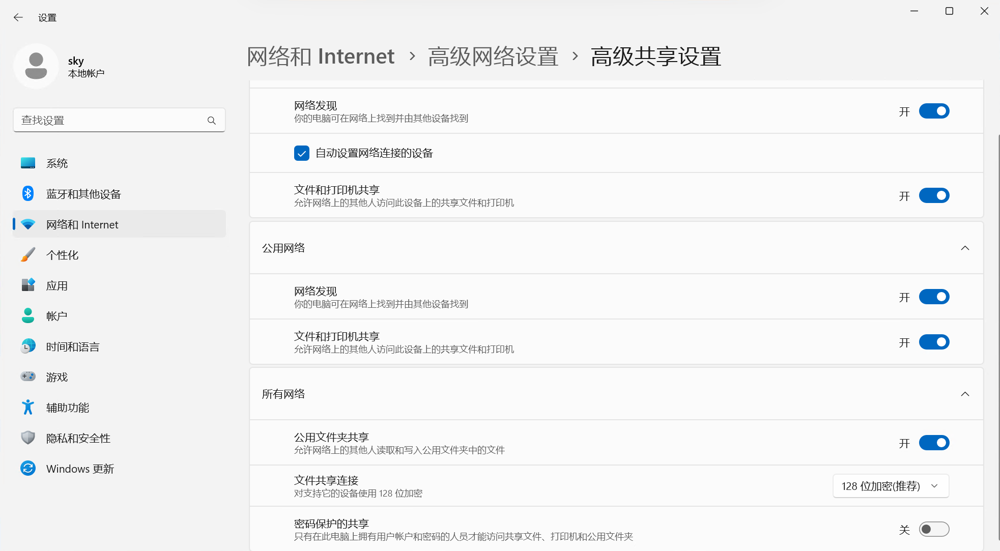

安装完成之后，为了方便使用，需要进行一些设置。

### 容许ping

如果发现无法 ping 到安装好的 windows 11 系统，通常是因为防火墙阻止了 ping 请求。

在防火墙中，容许 ping 请求的方式是：

1. 打开 windows defender 防火墙
2. 点击 “高级设置”
3. 在“入站规则”中，找到“文件和打印机共享 (回显请求 - ICMPv4-In)”，右键点击，选择“属性”
4. 在“属性”窗口中，点击“启用规则”，然后点击“确定”

类似的有四个，都一起开启吧。 

### 启动远程桌面

windows 11 默认是关闭远程桌面的，需要手动开启。

打开 "系统设置" -> "远程桌面" -> "启用远程桌面":

另外需要开启 windows defender 防火墙的远程桌面规则。

1. 打开 windows defender 防火墙
2. 点击 “高级设置”
3. 在“入站规则”中，找到“远程桌面 (TCP-In)”，右键点击，选择“属性”
4. 在“属性”窗口中，点击“启用规则”，然后点击“确定”

### 启动文件共享

打开 "设置" -> "网络和internet" -> "高级网络设置" -> "高级共享设置":

为一些常见的目录设置高级共享：

- `C:\Users\sky\data\shared`
- `C:\Users\sky\Downloads`

另外去掉默认的 `C:\Users\` 的共享。

